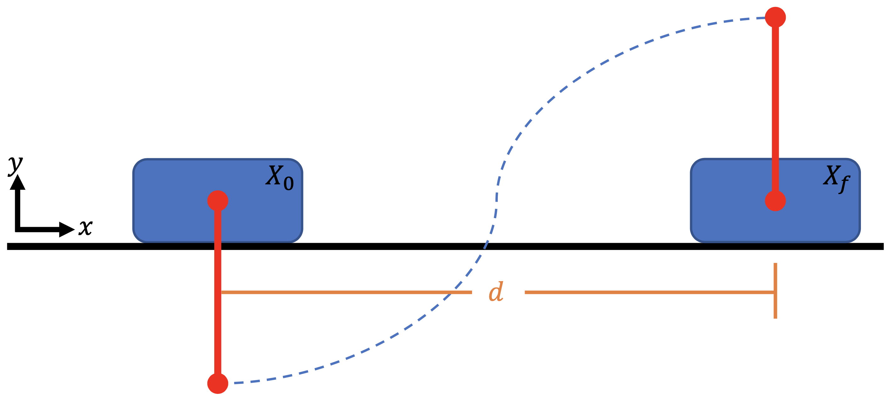
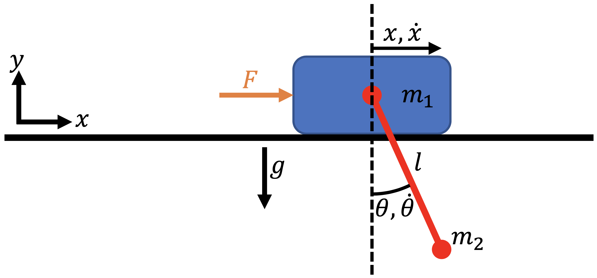
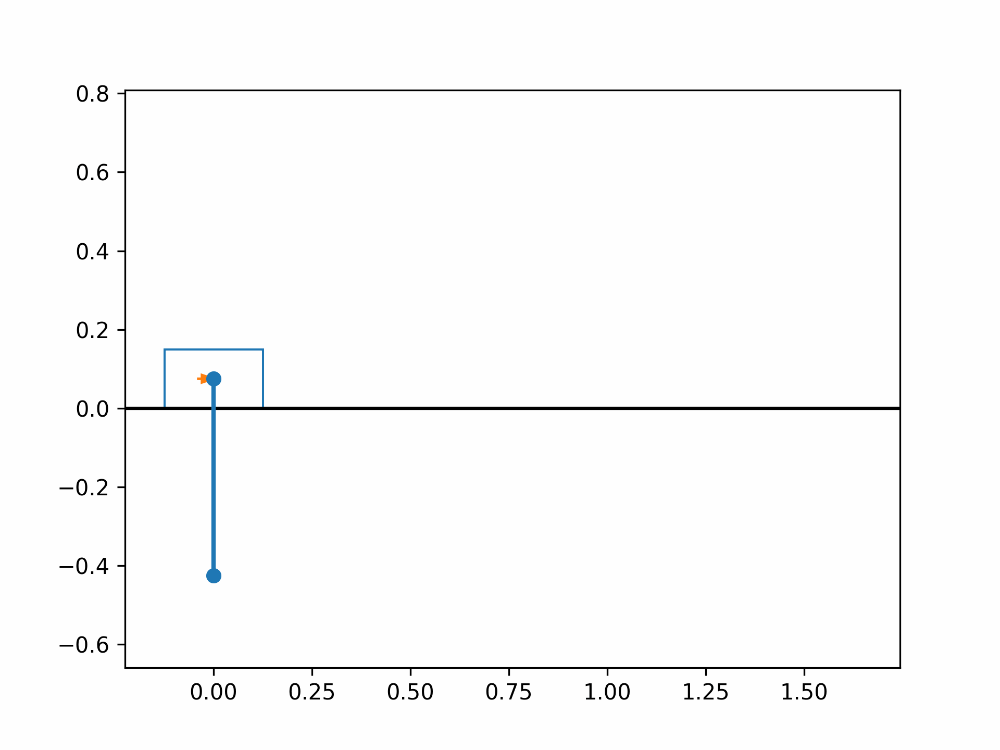

```python
# tags: active-ipynb, remove-input, remove-output
# This cell is mandatory in all Dymos documentation notebooks.
missing_packages = []
try:
    import openmdao.api as om  # noqa: F401
except ImportError:
    if 'google.colab' in str(get_ipython()):
        !python -m pip install openmdao[notebooks]
    else:
        missing_packages.append('openmdao')
try:
    import dymos as dm  # noqa: F401
except ImportError:
    if 'google.colab' in str(get_ipython()):
        !python -m pip install dymos
    else:
        missing_packages.append('dymos')
try:
    import pyoptsparse  # noqa: F401
except ImportError:
    if 'google.colab' in str(get_ipython()):
        !pip install -q condacolab
        import condacolab
        condacolab.install_miniconda()
        !conda install -c conda-forge pyoptsparse
    else:
        missing_packages.append('pyoptsparse')
if missing_packages:
    raise EnvironmentError('This notebook requires the following packages '
                           'please install them and restart this notebook\'s runtime: {",".join(missing_packages)}')
```

(examples:cart_pole)=
# Cart-Pole Optimal Control

This example is authored by Shugo Kaneko and Bernardo Pacini of the [MDO Lab](https://mdolab.engin.umich.edu/).
The cart-pole problem is an instructional case described in _An introduction to trajectory optimization: How to do your own direct collocation_ {cite}`Kelly2017`, and is adapted to work within Dymos.
We consider a pole that can rotate freely attached to a cart, on which we can exert an external force (control input) in the $x$-direction.

Our goal is to bring the cart-pole system from an initial state to a terminal state with minimum control efforts.
The initial state is the stable stationary point (the cart at a stop with the pole vertically down), and the terminal state is the unstable stationary state (the cart at a stop but with the pole vertically up).
Friction force is ignored to simplify the problem.



## Trajectory Optimization Problem

We use the following quadratic objective function to approximately minimize the total control effort:
\begin{equation}
    J = \int_{t_0}^{t_f} F(t)^2 dt ~~ \rightarrow ~ \min
\end{equation}
where $F(t)$ is the external force, $t_0$ is the initial time, and $t_f$ is the final time.

### Dynamics

The equations of motion of the cart-pole system are given by

\begin{equation}
    \begin{bmatrix}
        \ddot{x} \\ \ddot{\theta}
    \end{bmatrix} =
    \begin{bmatrix}
        \cos \theta & \ell  \\ m_1 + m_2 & m_2 \ell \cos \theta
    \end{bmatrix}^{-1}
    \begin{bmatrix}
        -g \sin \theta \\ F + m_2 \ell \dot{\theta}^2 \sin \theta
    \end{bmatrix}
\end{equation}

where $x$ is the cart location, $\theta$ is the pole angle, $m_1$ is the cart mass, $m_2$ is the pole mass, and $\ell$ is the pole length.



Now, we need to convert the equations of motion, which are a second-order ODE, to a first-order ODE.
To do so, we define our state vector to be $X = [x, \dot{x}, \theta, \dot{\theta}]^T$.
We also add an "energy" state $e$ and set $\dot{e} = F^2$ to keep track of the accumulated control input.
By setting setting $e_0 = 0$, the objective function is equal to the final value of the state $e$:

\begin{equation}
    J = \int_{t_0}^{t_f} \dot{e} ~dt = e_f
\end{equation}

To summarize, the ODE for the cart-pole system is given by

\begin{equation}
    \begin{bmatrix}
        \dot{x} \\ \dot{\theta} \\ \ddot{x} \\ \ddot{\theta} \\ \dot{e} 
    \end{bmatrix} =
    f \left(
        \begin{bmatrix}
        x \\ \theta \\ \dot{x} \\ \dot{\theta} \\ e 
    \end{bmatrix}
    \right)=
    \begin{bmatrix}
        \dot{x}  \\
        \dot{\theta} \\
        \frac{-m_2 g \sin \theta \cos \theta - (F + m_2 \ell \dot{\theta}^2 \sin \theta)}{m_2 \cos^2 \theta - (m_1 + m_2)} \\
        \frac{(m_1 + m_2) g \sin \theta + \cos \theta (F + m_1 \ell \dot{\theta}^2 \sin \theta)}{m_2 \ell \cos^2 \theta - (m_1 + m_2) \ell} \\ 
        F^2 \\ 
    \end{bmatrix}
\end{equation}

### Initial and terminal conditions
The initial state variables are all zero at $t_0 = 0$, and the final conditions at time $t_f$ are
\begin{align}
    x_f &= d \\
    \dot{x}_f &= 0 \\
    \theta_f &= \pi \\
    \dot{\theta_f} &= 0
\end{align}

### Parameters
The fixed parameters are summarized as follows.

| Parameter      | Value       | Units      | Description                                |
|----------------|-------------|------------|--------------------------------------------|
| $m_1$          | 1.0         | kg         | Cart mass                                  |
| $m_2$          | 0.3         | kg         | Pole mass                                  |
| $\ell$         | 0.5         | m          | Pole length                                |
| $d$            | 2           | m          | Cart target location                       |
| $t_f$          | 2           | s          | Final time                                 |

## Implementing the ODE
We first implement the cart-pole ODE as an `ExplicitComponent` as follows:


```python
import openmdao.api as om
om.display_source("dymos.examples.cart_pole.cartpole_dynamics")
```

## Building and running the problem

The following is a runscript of the cart-pole optimal control problem.
First, we instantiate the OpenMDAO problem and set up the Dymos trajectory, phase, and transcription.

```python
"""
Cart-pole optimizatio runscript
"""

import numpy as np
import openmdao.api as om
import dymos as dm
from dymos.examples.plotting import plot_results
from dymos.examples.cart_pole.cartpole_dynamics import CartPoleDynamics

p = om.Problem()

# --- instantiate trajectory and phase, setup transcription ---
traj = dm.Trajectory()
p.model.add_subsystem('traj', traj)
phase = dm.Phase(transcription=dm.GaussLobatto(num_segments=40, order=3, compressed=True, solve_segments=False), ode_class=CartPoleDynamics)
# NOTE: set solve_segments=True to do solver-based shooting
traj.add_phase('phase', phase)
```

Next, we add the state variables, controls, and cart-pole parameters.

```python
# --- set state and control variables ---
phase.set_time_options(fix_initial=True, fix_duration=True, duration_val=2., units='s')
# declare state variables. You can also set lower/upper bounds and scalings here.
phase.add_state('x', fix_initial=True, lower=-2, upper=2, rate_source='x_dot', shape=(1,), ref=1, defect_ref=1, units='m')
phase.add_state('x_dot', fix_initial=True, rate_source='x_dotdot', shape=(1,), ref=1, defect_ref=1, units='m/s')
phase.add_state('theta', fix_initial=True, rate_source='theta_dot', shape=(1,), ref=1, defect_ref=1, units='rad')
phase.add_state('theta_dot', fix_initial=True, rate_source='theta_dotdot', shape=(1,), ref=1, defect_ref=1, units='rad/s')
phase.add_state('energy', fix_initial=True, rate_source='e_dot', shape=(1,), ref=1, defect_ref=1, units='N**2*s')  # integration of force**2. This does not have the energy unit, but I call it "energy" anyway.

# declare control inputs
phase.add_control('f', fix_initial=False, rate_continuity=False, lower=-20, upper=20, shape=(1,), ref=0.01, units='N')

# add cart-pole parameters (set static_target=True because these params are not time-depencent)
phase.add_parameter('m_cart', val=1., units='kg', static_target=True)
phase.add_parameter('m_pole', val=0.3, units='kg', static_target=True)
phase.add_parameter('l_pole', val=0.5, units='m', static_target=True)
```

We set the terminal conditions as boundary constraints and declare the optimization objective.

```python

# --- set terminal constraint ---
# alternatively, you can impose those by setting `fix_final=True` in phase.add_state()
phase.add_boundary_constraint('x', loc='final', equals=1, ref=1., units='m')  # final horizontal displacement
phase.add_boundary_constraint('theta', loc='final', equals=np.pi, ref=1., units='rad')  # final pole angle
phase.add_boundary_constraint('x_dot', loc='final', equals=0, ref=1., units='m/s')  # 0 velocity at the and
phase.add_boundary_constraint('theta_dot', loc='final', equals=0, ref=0.1, units='rad/s')  # 0 angular velocity at the end
phase.add_boundary_constraint('f', loc='final', equals=0, ref=1., units='N')  # 0 force at the end

# --- set objective function ---
# we minimize the integral of force**2.
phase.add_objective('energy', loc='final', ref=100)
```

Next, we configure the optimizer and declare the total Jacobian coloring to accelerate the derivative computations.
We then call the `setup` method to setup the OpenMDAO problem.

```python
# --- configure optimizer ---
p.driver = om.pyOptSparseDriver()
p.driver.options["optimizer"] = "IPOPT"
# IPOPT options
p.driver.opt_settings['mu_init'] = 1e-1
p.driver.opt_settings['max_iter'] = 600
p.driver.opt_settings['constr_viol_tol'] = 1e-6
p.driver.opt_settings['compl_inf_tol'] = 1e-6
p.driver.opt_settings['tol'] = 1e-5
p.driver.opt_settings['print_level'] = 0
p.driver.opt_settings['nlp_scaling_method'] = 'gradient-based'
p.driver.opt_settings['alpha_for_y'] = 'safer-min-dual-infeas'
p.driver.opt_settings['mu_strategy'] = 'monotone'
p.driver.opt_settings['bound_mult_init_method'] = 'mu-based'
p.driver.options['print_results'] = False

# declare total derivative coloring to accelerate the UDE linear solves
p.driver.declare_coloring()

p.setup(check=False)

```

Now we are ready to run optimization. But before that, set the initial optimization variables using `set_val` methods to help convergence.

```python
# --- set initial guess ---
# The initial condition of cart-pole (i.e., state values at time 0) is set here because we set `fix_initial=True` when declaring the states.
phase.set_time_val(initial=0.0)  # set initial time to 0.
phase.set_state_val('x', vals=[0, 1, 1], time_vals=[0, 1, 2], units='m')
phase.set_state_val('x_dot', vals=[0, 0.1, 0], time_vals=[0, 1, 2], units='m/s')
phase.set_state_val('theta', vals=[0, np.pi/2, np.pi], time_vals=[0, 1, 2], units='rad')
phase.set_state_val('theta_dot', vals=[0, 1, 0], time_vals=[0, 1, 2], units='rad/s')
phase.set_state_val('energy', vals=[0, 30, 60], time_vals=[0, 1, 2])
phase.set_control_val('f', vals=[3, -1, 0], time_vals=[0, 1, 2], units='N')

# --- run optimization ---
dm.run_problem(p, run_driver=True, simulate=True, simulate_kwargs={'method': 'Radau', 'times_per_seg': 10})
# NOTE: with Simulate=True, dymos will call scipy.integrate.solve_ivp and simulate the trajectory using the optimized control inputs.
```

After running optimization and simulation, the results can be plotted using the `plot_results` function of Dymos.

```python

# --- get results and plot ---
# objective value
obj = p.get_val('traj.phase.states:energy', units='N**2*s')[-1]
print('objective value:', obj)

# get optimization solution and simulation (time integration) results
sol = om.CaseReader(p.get_outputs_dir() / 'dymos_solution.db').get_case('final')
sim = om.CaseReader(traj.sim_prob.get_outputs_dir() / 'dymos_simulation.db').get_case('final')

# plot time histories of x, x_dot, theta, theta_dot
plot_results([('traj.phase.timeseries.time', 'traj.phase.timeseries.x', 'time (s)', 'x (m)'),
              ('traj.phase.timeseries.time', 'traj.phase.timeseries.x_dot', 'time (s)', 'vx (m/s)'),
              ('traj.phase.timeseries.time', 'traj.phase.timeseries.theta', 'time (s)', 'theta (rad)'),
              ('traj.phase.timeseries.time', 'traj.phase.timeseries.theta_dot', 'time (s)', 'theta_dot (rad/s)'),
              ('traj.phase.timeseries.time', 'traj.phase.timeseries.f', 'time (s)', 'control (N)')],
             title='Cart-Pole Problem', p_sol=sol, p_sim=sim)

# uncomment the following lines to show the cart-pole animation
# x = sol.get_val('traj.phase.timeseries.x', units='m')
# theta = sol.get_val('traj.phase.timeseries.theta', units='rad')
# force = sol.get_val('traj.phase.timeseries.f', units='N')
# npts = len(x)

# from dymos.examples.cart_pole.animate_cartpole import animate_cartpole
# animate_cartpole(x.reshape(npts), theta.reshape(npts), force.reshape(npts), interval=20, force_scaler=0.02)
```

The optimized cart-pole motion should look like the following:



## References

```{bibliography}
:filter: docname in docnames
```
