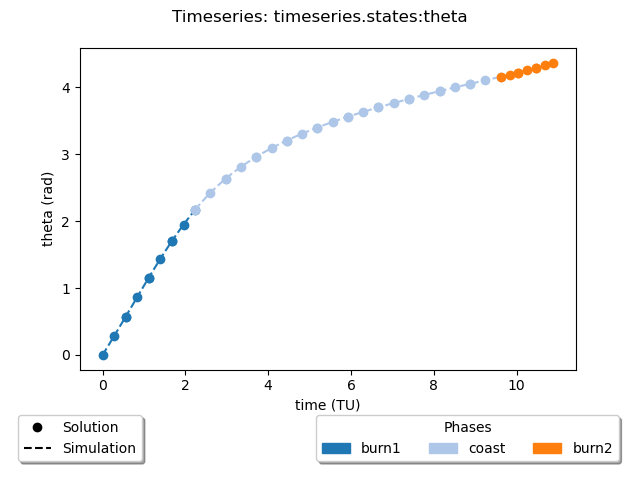

```python
# tags: active-ipynb, remove-input, remove-output
# This cell is mandatory in all Dymos documentation notebooks.
missing_packages = []
try:
    import openmdao.api as om  # noqa: F401
except ImportError:
    if 'google.colab' in str(get_ipython()):
        !python -m pip install openmdao[notebooks]
    else:
        missing_packages.append('openmdao')
try:
    import dymos as dm  # noqa: F401
except ImportError:
    if 'google.colab' in str(get_ipython()):
        !python -m pip install dymos
    else:
        missing_packages.append('dymos')
try:
    import pyoptsparse  # noqa: F401
except ImportError:
    if 'google.colab' in str(get_ipython()):
        !pip install -q condacolab
        import condacolab
        condacolab.install_miniconda()
        !conda install -c conda-forge pyoptsparse
    else:
        missing_packages.append('pyoptsparse')
if missing_packages:
    raise EnvironmentError('This notebook requires the following packages '
                           'please install them and restart this notebook\'s runtime: {",".join(missing_packages)}')
```

# Plotting Timeseries

Dymos provides a simple function to plot timeseries,

`timeseries_plots(solution_recorder_filename, simulation_record_file=None, plot_dir="plots")`

A separate plot file will be created for each timeseries variable. The plots will be saved and not 
displayed. The user has to manually open the plot files for them to be displayed.

The only required argument, `solution_recorder_filename`, is the file path to the case recorder file 
containing the solution results.

If the optional argument, `simulation_record_file`, is given, then that will be used to get data for
plotting the timeseries of the simulation. 

Finally, the optional argument, `plot_dir`, can be set to indicate to what directory the plot files will be saved.

Here is an example of the kind of plot that is created.


